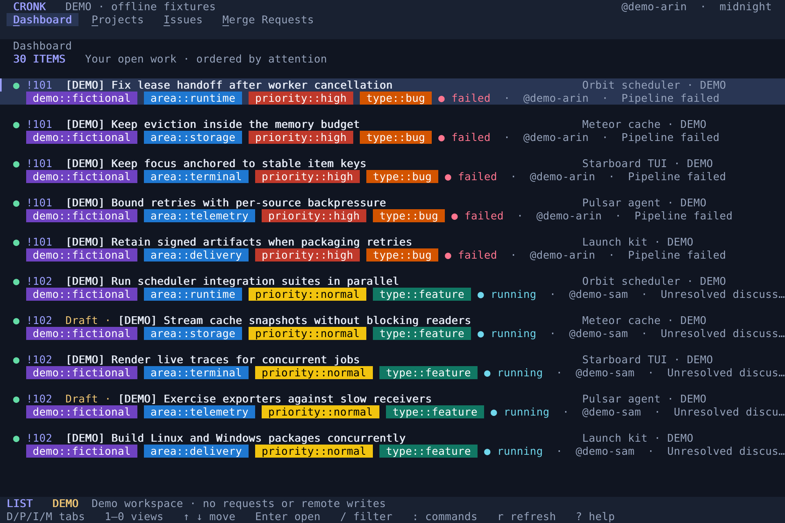
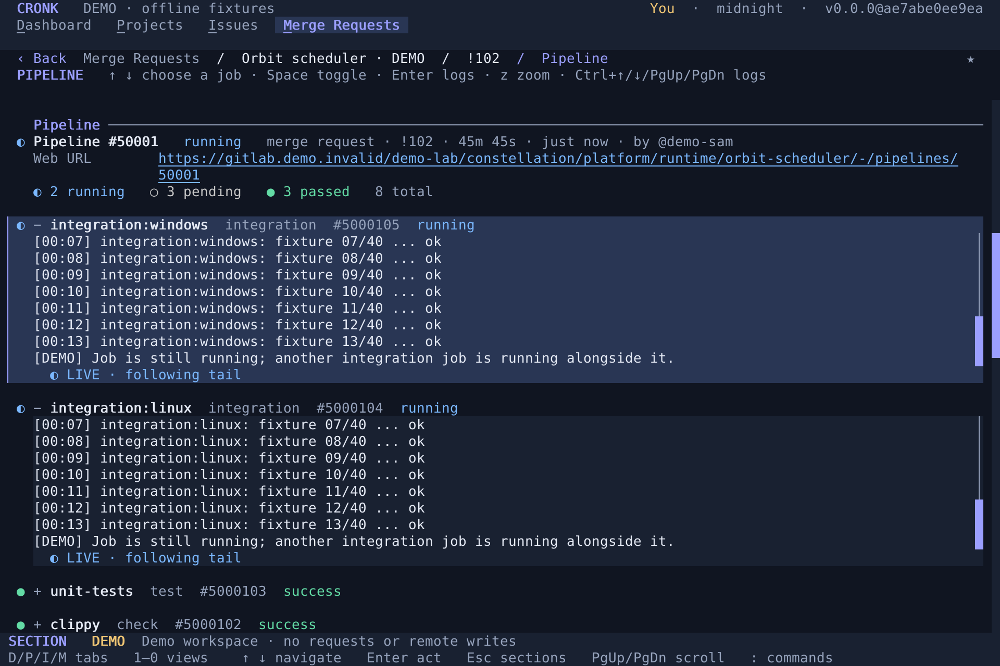
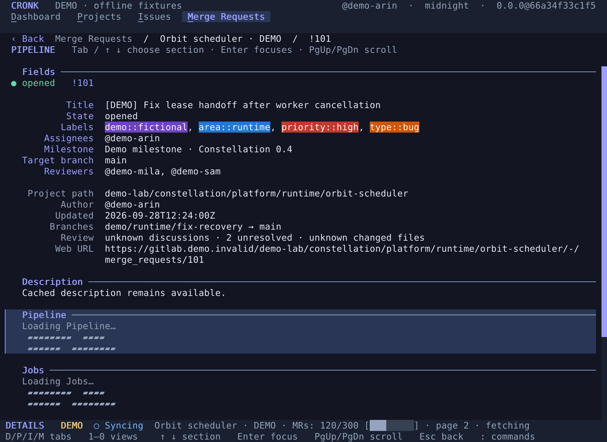

# Cronk

A keyboard-first, multi-project GitLab terminal workspace, built with Rust and [tui-lipan](https://github.com/tui-lipan/tui-lipan). Short project aliases, real GitLab label colors, scoped navigation, and concurrent pipeline logs—without opening another browser tab.

**Status:** runnable first version, not complete GitLab UI parity. The REST client is tested against local mock servers; it has not yet been verified against a real installation. See [current limits](#current-limits) before relying on it for daily work.



## Try it

Requires a current stable Rust toolchain and a UTF-8 terminal. Truecolor and mouse reporting give the intended appearance; no Nerd Font or emoji font is required.

```sh
cargo run --locked -- --demo
```

Demo mode includes five deeply nested fictional projects, forty issues/MRs, discussions, diffs, and simulated live traces. **It never contacts GitLab and does not simulate successful remote writes.** Filters, project visibility, saved views, aliases, and themes work normally. Its workspace is saved separately as `config.demo.toml`.

First launch opens **Welcome to Cronk**. To revisit it, use **Ctrl+P → Set up GitLab** or:

```sh
cargo run --locked -- --demo --onboarding
```

Demo onboarding checks environment-variable names and URL syntax without reading credentials or making requests. Add fictional project paths or IDs (`9001` through `9005`), separated by commas or newlines. The existing demo projects are prefilled. **Save setup** persists the checked settings to the demo config; **Skip setup** discards the draft. Both set `onboarding = false`. To capture the dialog without changing your workspace:

```sh
cargo run --locked -- --demo --onboarding --snapshot onboarding.png
```

For a faster optimized build:

```sh
cargo build --release --locked
./target/release/cronk --demo
```

`cronk --version` (or `cronk -V`) reports the same `release-tag@commit-sha` identifier as the TUI header, for example `cronk v0.0.3@0123456789ab`. Untagged development builds use `0.0.0` as the version; builds without commit metadata use `unknown` as the SHA. Version flags exit without loading a workspace or connecting to GitLab.

### Connect to enterprise GitLab

Run `cronk` to open first-run setup, even before credentials are configured. It asks for the token **environment variable name** (default `GITLAB_TOKEN`), instance URL (default `https://gitlab.com`), and one or more project paths/IDs. Checks run asynchronously after edits: authentication verifies the instance and token, and each project is resolved through GitLab. Export the token before starting Cronk; environment changes in another shell require a restart. Save is allowed only once all checks succeed. The dialog shows the config path for later manual editing.

Alternatively, initialize the file from the CLI:

```sh
cargo run --locked -- --init --host https://gitlab.company.example
```

The command prints the configuration path. Set `GITLAB_TOKEN` using your usual secret-management workflow, then:

```sh
cargo run --locked -- --check
cargo run --locked
```

Create a personal access token with `read_api` for browsing, or `api` for editing, posting, creating issues/MRs, and retrying jobs. Your account must also have the required project permissions. Do not put the token in a command argument or the TOML file. `token_env` can name a different environment variable.

Open **Ctrl+P → Add existing GitLab project**. Search by project name, choose a suggestion, and optionally set a short alias. A numeric ID or full `group/subgroup/project` path also works. This registers an existing project locally; it does not create a project on GitLab. Use separate `--config path/to/workspace.toml` files for different hosts. `--host` / `GITLAB_URL` cannot silently repoint a populated workspace to another host.

Enterprise URL prefixes such as `https://host.example/gitlab` are supported. HTTPS and native system certificate roots are used. Install your company CA into the system trust store, or set `NODE_EXTRA_CA_CERTS` to a PEM file containing one or more additional trusted CA certificates:

```sh
export NODE_EXTRA_CA_CERTS=/path/to/company-ca-bundle.pem
cargo run --locked -- --check
```

The bundle supplements (does not replace) system trust roots and is read when the GitLab client is created; restart Cronk after changing it. An unset or empty variable uses system roots only. An unreadable, malformed, or certificate-free bundle is an initialization error rather than silently ignoring the configured trust. Certificate and hostname verification remain enabled. There is deliberately no insecure-TLS switch. Redirects are rejected rather than forwarding credentials. HTTP is permitted only for loopback development/test servers.

## Navigation

| Key / gesture | Action |
| --- | --- |
| `↑` / `↓`, `Tab` / `Shift+Tab`, `k` / `j` | Move within the current scope |
| `Enter` | Open item → focus section actions → edit field; submit a dialog |
| `Esc` | Cancel editor, or go back exactly one scope |
| `Shift+D` / `Shift+P` / `Shift+I` / `Shift+M` | Open Dashboard / Projects / Issues / Merge Requests |
| `1`–`9`, `0` | Open saved views 1–9, then the tenth view |
| `←` / `→` | Switch to the previous / next tab (no wraparound) |
| `Esc` from a list | No action; the list remains active |
| `Home` / `End` | First/last item or section; in a focused text section, document start/end |
| `PageUp` / `PageDown` | Page through a list or scroll the whole detail document |
| Mouse click / wheel | Open rows, choose tabs/sections, select fields, scroll |
| Scrollbar track click / thumb drag | Scroll the corresponding viewport without activating its contents |
| `Space` in Projects | Include/hide the selected project in other lists |
| `Space` in Jobs | Expand/collapse the selected job, including running jobs |
| `Enter` on a job | Focus its logs (expanding if needed); arrows/page keys scroll logs |
| `Ctrl+↑/↓`, `Ctrl+PageUp/PageDown` on a job | Scroll its logs without entering log focus |
| `z` on a job / in its logs | Toggle zoom directly; mouse wheel and draggable scrollbar scroll zoomed logs |
| `Home` / `End` in logs | Beginning / live tail; End resumes following new output |
| `/`, then `n` / `N` in logs | Literal, case-insensitive search; next/previous matching line |
| `Ctrl+P` or `:` | Searchable command palette |
| `/` | Edit the current list's filter |
| `s` | Save an Issues/Merge Requests filter as a new tab |
| `n` | Create an issue, or MR when browsing an MR list |
| `c` in a detail | Add a comment |
| `R` / `Enter` in Discussions | Reply to the selected thread |
| `x` in Discussions | Confirm resolve/reopen |
| `r` in Jobs | Confirm retry of the selected finished job |
| `r` elsewhere / `Ctrl+R` | Refresh all visible projects and the open detail |
| `Ctrl+J` in a multiline editor | Insert a newline (`Enter` submits) |
| `?` | Keyboard guide |
| `q` / `Ctrl+C` | Quit outside text editors |

Each tab restores its last list or drilled-down detail scope, including selection, scroll position, and explicit job expansion/collapse choices. Navigation is saved to the workspace file for restart; item details and in-flight detail requests are shared across tabs and refreshed when due, while log buffers and reading positions remain per-tab. A new tab's list is active immediately; there is no separate tab-navigation mode. Left/Right switch tabs without wrapping; Up/Down navigate the current scope. Modified arrows do not switch tabs. The built-in tab initials are underlined, saved tabs display their number shortcuts, and the bottom gutter repeats the hints. Tab shortcuts are inactive inside dialogs/editors. More than ten saved views remain accessible by Left/Right or mouse; the tab strip scrolls horizontally when necessary.

Lists use a quarter-viewport boundary: the cursor moves to the lower/upper quarter margin, the viewport follows further movement, then the cursor reaches the actual final/first row. No wraparound. Three terminal rows form one list item; the margin rounds down to whole items.

Overflowing lists, detail panes, dialogs, and multiline editors show a theme-colored scrollbar at their right edge. The thumb indicates the visible fraction and current position; click the track or drag the thumb to scroll. Mouse scrolling keeps list selection visible, keyboard navigation continues from there, and unchanged refreshes do not pull the viewport back. Scrollbars disappear when content fits. Pointer hover lifts interactive surfaces slightly so tabs, rows, visibility dots, section headers, fields, jobs, discussions, dialog actions, completion choices, and scrollbar thumbs react before a click; selected rows stay distinct from hover. Clicks briefly flash a stronger lift unless `animations = false`.

The Dashboard shows open work where you are the author, assignee, or (for MRs) a reviewer. Each row separates **why it is here** (your role) from its **attention signals**: failed pipeline, known unresolved threads, reviewer assignment, missing reviewers on your ready MR, passing/in-progress checks, draft state, or otherwise open work. Multiple signals can appear together. It orders actionable blockers first, then review assignments and reviewer gaps, then checks in progress, drafts, other MRs, and issues. Reviewer assignment does not prove a review is still pending, and a missing discussion count is unknown rather than zero. Passing checks are not a claim that approvals, mergeability, or company policy checks are satisfied. Enter opens the real detail while preserving the Dashboard as the return destination.

Issue and MR details are **one continuous document**, with one main document scrollbar and no section sidebar or split panes; expanded job logs also have their own history scrollbars. Issues show Fields, Description, and all Activity (newest first). MRs show Fields, Description, Pipeline, Jobs, every Discussion and its notes, and Changes. Nothing needs to be opened just to read a section; completed job logs remain collapsed until requested.

**Tab / Shift+Tab or Up / Down** select sections and bring their heading into view. The current section has a selection background; GitLab label colors stay intact. **Enter** focuses a section's actions without replacing the document: choose/edit fields, expand or retry jobs, reply to or resolve discussions, or edit the description. **Esc** returns to section navigation without resetting the viewport, then returns to the work list. **PageUp / PageDown**, the wheel, and the scrollbar scroll the whole document except when page keys are focusing job logs or the wheel is over zoomed logs. Clicking a section heading selects it; clicking a field edits it, a job toggles it, and a discussion selects its thread.

### CI job logs

Running jobs expand automatically, so concurrent live logs remain visible together. **Space** or the job's **+/−** header toggles expansion; a manual collapse survives refreshes, tab switches, and restart. Selection styling runs alongside the entire expanded job, not just its header.

In Jobs, **↑/↓** choose a job. **Enter** focuses its logs; **↑/↓**, **PageUp/PageDown**, and **Home/End** then navigate the output. **Ctrl+↑/↓** and **Ctrl+PageUp/PageDown** scroll the selected job's logs without focusing it (where the terminal reports those combinations). **z** toggles zoom straight from selection or log focus. Zoom reclaims the normal application chrome, keeping only a contextual shortcut header and log status, with a proportional, clickable/draggable scrollbar and mouse-wheel scrolling. First opening zoom follows the tail by default; an existing manually scrolled position is preserved.

At the bottom, incoming output keeps the viewport following the live tail. Scrolling away from the bottom anchors the visible source lines while new output arrives below. Returning to the bottom, or pressing **End**, resumes following. The same rule applies to inline and zoomed logs.

In focused or zoomed logs, **/** opens a literal, case-insensitive search over fetched history. **Enter** jumps to a match; **n/N** move forward/backward through matching lines with wraparound. Matching substrings on the current matching line use a strong yellow background; other matches use a softer yellow. Both keep readable dark text, including across ANSI color changes, and the stronger highlight moves with **n/N**. Search does not filter or edit the log. **Esc** closes search, then zoom, then log focus, before leaving Jobs. A zoom opened directly from selection returns directly to job navigation.

Log rendering preserves ANSI SGR colors (standard/bright, 256-color, and truecolor) and supported text styles, inline and fullscreen. Styles carry across lines and fetch chunks, including when scrolling into the middle of colored output. Cursor movement, screen clearing, clipboard/OSC commands, and other terminal controls remain stripped; this is not a terminal emulator. Programs must actually emit ANSI color codes into the job trace—colors suppressed by the CI tool cannot be recovered.

Complete fetched history is retained in memory for scrolling and search; only visible lines are rendered. Search covers output fetched so far, not bytes still being loaded. Log positions are retained across tab visits, but log history, searches, and log-focus/zoom state are not written to disk. Large traces consequently use more memory until their item cache is discarded.

Project rows open a project details view. A green solid status dot means the project is included in work lists; a grey outline means it is hidden. Click the dot or press **Space** to toggle. The details page shows path, ID, open-work counts, an editable local alias, and a red **Remove from workspace** action. Alias and remove are no longer command-palette actions. When adding a project, leaving the optional alias blank keeps GitLab's short display name as the starting local alias; an empty alias later falls back to the full path.

## Name-based field completion

Assignees, reviewers, milestones, and iterations suggest GitLab matches as you type. Use **↑ / ↓** to choose, **Enter** to insert a suggestion, then **Enter** again to save the form. Clicking a suggestion only inserts it; it never submits. **Tab / Shift+Tab** still switch fields and **Esc** cancels the editor. Press an arrow key to open suggestions without changing the text.

For assignees and reviewers, separate people with commas: `@alex, Sam`. Each lookup uses the trimmed token at the caret after the previous comma, so spaces around entries are fine. Accepting a suggestion replaces only that token, leaving the other people untouched. Suggestions show display names and usernames; accepted people use unambiguous `@username` tokens. Milestones and iterations are single-valued and may contain commas in their names. Iteration lookups also offer a symbolic `Current` choice; typing `current` in any casing matches it, and saving resolves it to the project's current iteration ID. Existing assignments retain their IDs behind their readable values; an empty field clears the assignment. Unresolved names must be chosen from suggestions before saving. Numeric IDs remain available as a fallback.

Searches are debounced for **300 ms**, with at most one lookup request in flight; obsolete responses cannot replace newer results. Each request fetches at most the first **20 matches**, and up to 32 queries are cached per field for the lifetime of the dialog. Refine your search to find more specific matches. Project members are searched by name/username; milestone and iteration lookups include ancestor groups. Untitled, automatically scheduled iterations show their date range and can be searched by cadence title where supported by GitLab. Lookup errors and rate limits retain your draft.

New issue/MR forms suggest projects from your workspace by alias or path. **Add existing project** searches your GitLab memberships. Demo mode uses local fictional matches and makes no lookup requests.

## Pipelines without tab switching



All running jobs in the open MR's head pipeline are expanded automatically and fetched independently. Finished jobs collapse unless explicitly expanded. The inline Pipeline section shows the summary; Jobs displays every job and its live tail in the same document, without duplicating logs. Select a finished job to inspect or retry it. Large pipelines still require scrolling when their panels cannot fit on one screen.

Logs are **near-real-time REST polling**, not a push stream. Each job keeps a byte offset, requests new data with HTTP Range, and appends only new text. UTF-8 and terminal escape sequences are handled across chunk boundaries; OSC/DCS and terminal controls are stripped. Responses are capped at 256 KiB of source bytes; the UI retains the latest 128 KiB per job. Completed logs are drained to EOF. Panels display trailing lines rather than a full searchable log archive.

## Filters and saved tabs

Filters run locally across the loaded visible projects. Space-separated terms are ANDed; repeating `label:` requires every listed label (for example, `label:foo label:bar` means both labels). There is no OR or grouping syntax; brackets and parentheses are not operators. Negate an attribute with `-`, and quote values containing spaces:

```text
project:checkout label:"team::payments" label:"type::bug" state:opened
iteration:Current assignee:@me -label:blocked
reviewer:@me pipeline:success draft:false
"lease handoff" -state:closed
```

Supported attributes: `project`, `label`, `state` (alias `status`), `assignee`, `author`, `reviewer`, `iteration`, `milestone`, `pipeline`, `draft`, and `kind`. All matching is case-insensitive. Labels, states, usernames and pipeline statuses are exact matches; project aliases/paths, iteration/milestone names, and free text are substring matches. `iteration:current` is a special symbolic match for each project's current iteration, which makes saved tabs follow the active sprint automatically. Use GitLab's `opened`, `closed`, or `merged` states. `@me` resolves to the authenticated username. Unknown syntax is rejected, not silently ignored.

Save a filter with `s` or **Save filter as a new tab**. Rename/remove it through the command palette. Changing a saved tab's active filter persists that working filter; saving again creates another named tab. The four built-in tabs cannot be renamed/deleted.

## Configuration and persistence

Default location follows the platform configuration directory (`~/.config/cronk/config.toml` on Linux). `--config` overrides it. Demo mode always substitutes the `.demo.toml` extension, even with `--config`. Generated files include a Cronk project link and a reminder that manual changes require an app restart. `onboarding = false` suppresses first-run setup after saving or skipping it; set it to `true` or pass `--onboarding` to reopen setup. Existing configuration files without this setting keep their previous startup behavior.

Configuration contains project IDs, full paths, local aliases, visibility, views, theme and user-display settings, active tab, list selections, open item, entered section, and selected field. `user_display` selects `username` (the default), `name`, or numeric `id`. To format structured GitLab names, set both `user_name_pattern` (a Rust regex with named captures) and `user_name_format` (a regex replacement such as `$firstname`); a non-matching name remains unchanged. Committed workspace/navigation events save immediately with a same-directory temporary file, file sync, and atomic replacement—not just on quit. Unix files are mode `0600`, with newly created directories `0700`. Invalid existing configuration is reported and not overwritten. **Do not run two instances against the same file**; there is no interprocess locking. Edit configuration while Cronk is stopped.

A minimal configuration (or use `config.example.toml` as a reference):

```toml
gitlab_url = "https://gitlab.company.example"
token_env = "GITLAB_TOKEN"
theme = "midnight"
animations = true
list_refresh_secs = 60
detail_refresh_secs = 10

[[projects]]
id = 1234
path = "company/division/platform/team/planning"
alias = "Team planning"
visible = true

[[views]]
name = "My iteration"
kind = "issue"
query = 'project:planning assignee:@me state:opened'
```

Theme names are `midnight`, `dracula`, `light`, `blade-runner` (neon), `tokyo-night`, `gruvbox-dark`, `nord`, `solarized-dark`, `solarized-light`, `sepia-dark`, and `sepia-light`, also selectable in the palette (Choose theme). The newer themes are checked for high text contrast and a visible hover state. Optional `[colors]` overrides: `background`, `surface`, `selection`, `foreground`, `muted`, `accent`, each `"#RRGGBB"`. Overrides remain active after choosing another preset. Label colors always come from GitLab and remain intact over selection and hover backgrounds. Set `animations = false` to keep static hover feedback while disabling click flashes and skeleton pulsing.

### Refresh and request budget

- Visible project lists: incremental refresh every **60 seconds**, including while viewing details. Issues and MRs import independently so one long history does not block the other.
- Active item details: every **10 seconds**, configurable down to 2 seconds (set 5 if preferred).
- Running/expanded job traces: every **2 seconds**, only for the open item; batches of at most four concurrent trace requests.
- Manual refresh: all visible projects and the active detail; does not bypass server backoff.
- Conditional GET with ETag/Last-Modified, shared across client clones; bounded **128-entry / 16 MiB** HTTP cache. Successful writes invalidate cached validators/bodies.
- Ordinary polls do not overlap for the same resource. Detail requests survive tab navigation and populate the shared item cache; successful writes invalidate caches and supersede older responses. Failures retain the last successful rows, detail sections, and editor drafts, and are displayed instead of becoming empty lists.
- Exponential backoff up to 320 seconds, honoring both numeric and HTTP-date `Retry-After` values. Requests already in flight may still finish.

### Persistent cache and loading feedback

Cronk stores lists and viewed detail sections in SQLite beside the workspace: `config.toml` uses a `config.cache/` directory. Databases are isolated by installation and credential fingerprint; switching tokens deliberately starts a separate cache. No token or job-log body is stored. On Unix the cache directory is private (`0700`) and databases are `0600`. Content is **not encrypted**: treat it like a local checkout containing potentially confidential project data.

- Cached lists/details appear before network refresh completes. First imports retain **all history**, publishing each durable page immediately; interrupted imports resume at an inclusive timestamp boundary and deduplicate identities.
- Successful checkpoints are separate for each project and issue/MR resource. Normal refreshes use `updated_after` with a two-minute overlap and a bounded `updated_before` window. Checkpoints advance only after a complete collection and durable commit, never after a failed page.
- Once per **24 hours**, or via **Full resync · reconcile all history** in the command palette, a full collection reconciles disappeared items. Missing cached identities are individually checked before removal, because pagination can move items during an import. Pipeline/discussion signals have independent, bounded dashboard refreshes rather than relying on the MR timestamp.
- The footer reports project/resource, received count, page and phase. A mini progress bar appears only when GitLab supplies a total; otherwise the loaded count is shown without an invented percentage. Backoff displays the retry countdown.
- Details render their structure immediately. The core item arrives first, then activity, discussions, pipeline/jobs and changes load independently (up to four section workers). Missing sections have pulsing skeletons; cached sections remain readable during refresh, and incomplete sections show warnings.
- **Clear local content cache** in the palette clears the current credential's cache after requests finish, pauses automatic polling, and returns to the list. Press `r` to import again. Other credential databases remain separate; remove the workspace's `.cache` directory while Cronk is stopped to remove all of them. This is not forensic secure deletion.



See [sync/cache design and the reproducible request-count comparison](docs/sync-cache.md).

No background service, telemetry, third-party data service, or agent invocation is involved. Runtime network traffic goes only to your configured GitLab instance. The workspace TOML contains configuration/navigation, not cached GitLab content or tokens; job traces remain memory-only. Cache initialization errors are reported and fall back to memory-only operation.

## Current limits

- **Not every GitLab field/filter is exposed.** Editors cover title, description, labels, state, assignees, milestones, issue iterations, MR target branch, and reviewers. Name completion covers labels, ID-backed fields, and projects, not branches. Iteration lookups require GitLab Premium/Ultimate; older versions may not support cadence-title search. Permission/version failures are shown rather than treated as empty results.
- Issue activity is the reverse-chronological notes/system-notes feed, not a merged feed of every GitLab resource-event endpoint. General comments and discussion replies are supported; inline diff comments, review submission/approvals, merging, artifacts, and interactive manual jobs are not yet implemented.
- Initial imports and daily/manual reconciliation still paginate **all history**; routine refreshes are incremental. GitLab pagination is not an atomic snapshot, and the timestamp feed is not a deletion/permission-change feed. Inclusive replay and identity checks reduce these risks but do not replace reconciliation. Hidden projects are not newly polled, although requests already started may finish. Cached content remains readable on network errors; stale access/content is reconciled only after successful server checks.
- Dashboard enrichment is bounded: at most 12 recently updated open MRs per project receive pipeline/discussion enrichment, with up to 12 additional discussion-page requests. Unknown values remain unknown. Open an MR to fetch its complete detail. A passed pipeline is not sufficient evidence that an MR is ready to merge.
- Child/downstream pipelines are not traversed. Fork-owned head-pipeline jobs use the pipeline's own project. Older GitLab versions/permissions may omit optional data; warnings identify incomplete details. Server-truncated diffs are reported when detectable.
- Trace reads use REST `byte_offset`/`byte_limit` parameters after a small, cached capability probe. Older servers that ignore or reject those parameters fall back to HTTP Range. If Range is also ignored, reads stream past the already-seen prefix (up to 8 MiB per request); larger prefixes produce an explicit error. Same-length log replacement cannot reliably be detected. Scrolling/search cover fetched history; no disk-backed log archive is provided.
- Unsubmitted dialog text and job-log bodies/reading positions/searches are **not restored after process death**. List selection, document offsets, the open item/section/field, and job expansion/collapse choices are restored alongside cached lists and viewed details, then refreshed. Failed submissions retain the draft while the process is running. Writes are never automatically retried: after an ambiguous timeout, verify GitLab before retrying a create/comment to avoid duplicates.
- The new sync/cache path is covered with local mock GitLab tests, not benchmarked against a live enterprise installation. Start with a test project/read-only token. Terminal appearance and key encodings should also be checked in your actual terminal/OS.

## Development

Install [cargo-nextest](https://nexte.st/docs/installation/) once (CI uses version 0.9.146):

```sh
cargo install cargo-nextest --locked --version 0.9.146
```

Pre-built binaries are also available from the installation link above to avoid compiling the runner.

```sh
cargo fmt --all -- --check
cargo clippy --all-targets -- -D warnings
cargo nextest run --locked --all-targets
cargo test --locked --doc
cargo run --locked -- --demo --snapshot dashboard.png
cargo run --locked --example gallery
```

Release builds use `Cross.toml` to forward `CRONK_RELEASE_TAG` and `GITHUB_SHA` into the build container. The release workflow executes each target binary's `--version` (using cross's runner/emulation where needed) and checks it against the requested tag and source commit before packaging, so missing metadata cannot silently produce a release labeled `0.0.0@unknown`.

Nextest runs the existing unit/integration tests without changes, scheduling tests across binaries with one process per test. `.config/nextest.toml` uses the available logical CPUs and disables retries; CI uses `--profile ci` to collect all failures. Nextest does not run doctests, so keep the separate `cargo test --locked --doc` command. The original `cargo test --locked --all-targets` remains a supported fallback if nextest is unavailable.

For a focused iteration, use `cargo nextest run --locked --test ui` (one integration-test target) or `cargo nextest run --locked --all-targets -E 'test(tab_switches)'` (matching test names). Avoid `--no-capture` when benchmarking: nextest runs tests serially in that mode. See [the runner comparison](docs/test-performance.md) for measured timings and reproduction steps.

The pre-commit hook runs the formatting check and Clippy with warnings denied. It is installed by `cargo-husky` the first time you build tests with `cargo nextest run` or `cargo test` after fetching dependencies.

`gallery` writes five deterministic PNG/Markdown captures to `.snapshots/` without touching your workspace or opening a terminal. Small-viewport and keyboard/mouse integration tests run through tui-lipan's actual headless runtime.

Module layout:

- `src/model.rs`: GitLab-independent domain types and mutations.
- `src/gitlab.rs`: REST pagination, conditional caching, safe trace decoding, writes.
- `src/config.rs`, `src/filter.rs`, `src/scroll.rs`: persistence, query grammar, boundary navigation.
- `src/ui/controller.rs`: explicit scopes, commands, polling, stale-response guards, dialogs.
- `src/ui/view.rs`: declarative views, themes, exact label styling, live panels.
- `src/demo.rs`: deterministic fictional fixtures.
- `tests/ui.rs`: keyboard, mouse, route/persistence, and async-result regression tests.
- `tests/scrollbars.rs`: scrollbar geometry, dragging, scrolling, resize/refresh, and dialog-focus regression tests.
- `src/ui/completion.rs`, `tests/autocomplete.rs`: comma-aware identity resolution, lookup scheduling, and autocomplete regression tests.

Licensed under Apache-2.0. tui-lipan is a separate MPL-2.0 dependency; using it does not change this application's license.
